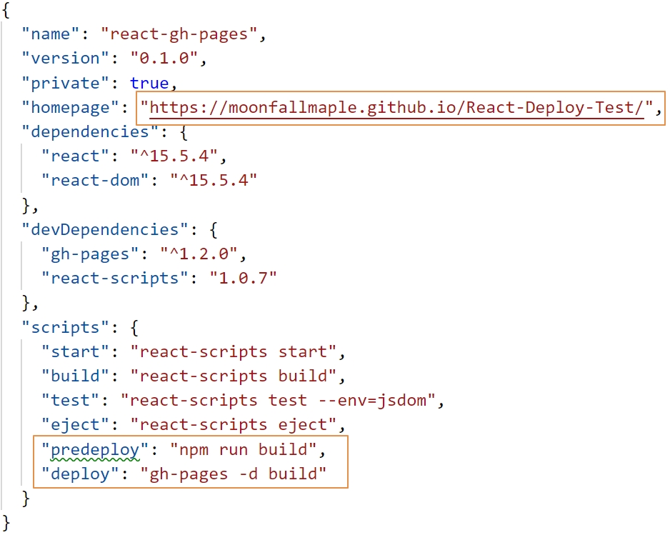
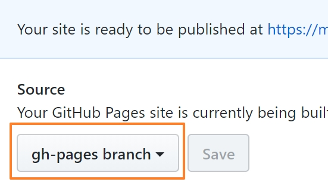

# React Deploy to Gitpage Test


## Table of Contents
* [Live Demo](#Live-Demo)
* [How to deploy](#project-instructions)


## Live Demo
 https://moonfallmaple.github.io/react-deploy-test/

## How to deploy

1. Create an empty repo at github. (No Readme, No gitignore, No license)<br/>

2. Create a new react app named YYY. 
 ```
 create-react-app YYY
 ```
3. open the YYY file, then install gh-pages package there 
```
npm install gh-pages –save-dev
```
4. Edit package.json file (XXX is your Github username, YYY is your repo name)

> Add property "homepage": "http://XXX.github.io/YYY", 

> Add property "predeploy": "npm run build",

> Add property "deploy": "gh-pages -d build" (This step is to set your git-pages under gh-pages branch. )

<div  align="center">

</div>

### Don't set **master** branch by yourself !!!

When you add property "deploy": "gh-pages -d build" to package.json, you already create a git-page and set it under gh-pages branch. 
<div  align="center">

</div>

5. Initialize git in YYY file
```
git init
```

6. Set your remote git repo location
```
git remote add origin https://github.com/XXX/YYY.git
```

7. Deploy
```
npm run deploy
```
